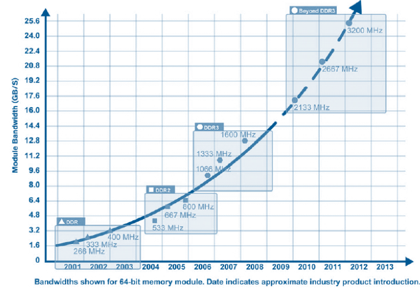

# **Introduction to Apache Spark**
Scriber: Christy Sato

## Data Science Cycle

- As part of the data science cycle, we need Spark for the following:
    - Data Understanding
    - Data Preperation
    - Modeling
    - Evaluation
    - Deployment
  
  
- With Apache Spark, we can see how to take the raw input data (like a data set in a HDFS) and transform it non-destructively to clean it up or analyze it
- Apache Spark allows pipelines which is useful when working with teams
    - Can have different people working on different tasks (i.e. changing emails/ editing)
    - Does not completely change the source data
 
 ## Hadoop
 - Hadoop uses single programming model: MapReduce
 - It only works on hard drives
 - The graph below shows exponential growth, but not a lot
 
 
 ## Spark
 - But with Spark, RAM bandwidth increases exponentially
 - This is because Spark can perform in-memory computations

- Spark has high-level tools, including:
    - Machine learning
    - Spark Streaming: enables high-throughput, fault-tolerant stream processing of live data streams
    - Spark SQL: runs SQL and HiveQl queries
    - GraphX: an API for graphs and graph-parallel computation
    
## Spark Architectural Components
- The first step is creating a Spark session, this is where you can:
    - define configurations like how many workers, RAM, GigaBytes, etc.
- The executors execute nodes that run on JAVA
    - Java unpacks Python file, but this could be problematic

## Spar 1.6+ vs. 2.0+
- Spark 1.6+ can write code in Python
- Spark 2.0+ can run joins and queries on high level data types

## Spark RDDs

- **Lineage**:
  - Information about how an RDD was derived from other datasets or other RDDs.
  - RDD is not necessarily materialized all the time.
  - Lineage captured on disk as "lineage graph."  
  
- **Persistence**:
  - Indicate which RDDs they want to keep in memory. 
  - User can call "persist" method.  
  
- **Partitioning**:
  - RDD elements can be partitioned across machines based on a key in each record.
  
## DataFrames
- The problem with RDDs is that they do not have enough structure
- They are harder to optimize and therefore slow
- DataFrames aim at solving this by adding structure.  
- A DataFrame is a distributed collection of data organized into named columns.  
- Similar to Pandas DataFrames but distributed across the cluster.

- Parquet is resourceful in reading dataframes
    - datasets are stored in columns, which are better than rows because:
        - can query columns
        - can add columns
        - can apply compression algorithms
